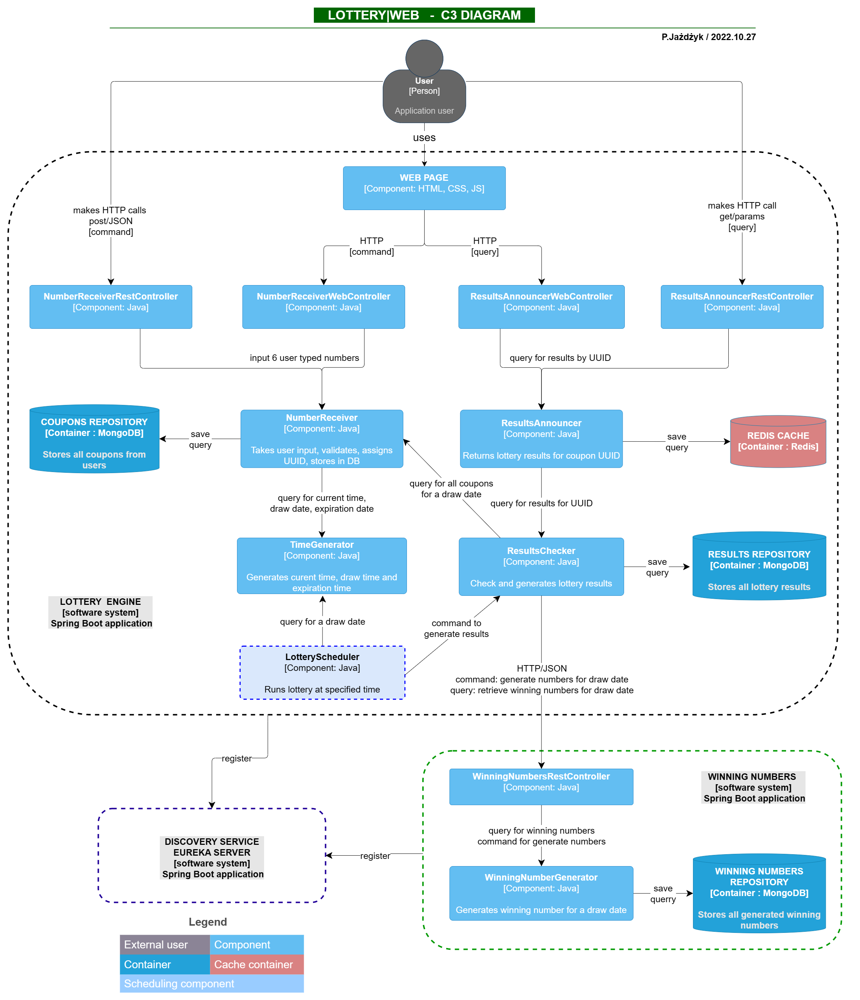

# Lottery|Web
## _Number lottery game - Spring Boot application_

Lotto|Web is a web port of the well-known number lottery game. The user provides 6 distinct numbers from 1 to 99 and receives a unique coupon identifier. 
Winning numbers are drawn once per week and all coupons are processed to determine winners. To become a winner user must score at least 3 matched numbers in the lottery. 
Users can retrieve lottery results anytime using their unique coupon identifier.

> VERSION: 1.0.0 <br>
> AUTHOR: PIOTR JAŻDŻYK <br>
> LINKEDIN: https://www.linkedin.com/in/pjazdzyk <br>

## Specification

- Spring Boot, web application,
- modular monolith hexagonal architecture with one module extracted as microservice,
- facade design pattern,
- noSQL databases (MongoDB) for coupon and results repositories,
- Good coverage with unit tests, including "happy path" integration tests,
- controllers tested via mockMvs, winning numbers service was stubbed using WireMock,
- Scheduled lottery run and results processing,
- Redis cache for optimized results queries,
- Docker is used for module containerization,
- Basic static landing page provided for presentation purposes,
- Application deployed on AWS Linux EC2 server

## Tech

Lotto|Web is developed using following technologies: <br>

Core: <br>
 &nbsp;
 &nbsp;
 &nbsp;
 &nbsp;
 &nbsp;
 &nbsp;

Testing:<br>
 &nbsp;
 &nbsp;
 &nbsp;

Front:<br>
 &nbsp;
 &nbsp;
 &nbsp;

Deployed on:<br>
 &nbsp;

## C3 diagram

The C3 diagram blow presents main application components and module dependencies. <br>
Click on image below to review it more readable size.

<a href="https://raw.githubusercontent.com/pjazdzyk/lottery-web/master/architecture/C3_Architecture.png"><br></a>

## Installation and run

Lotto|Web requires [Docker](https://www.docker.com/products/docker-desktop/) to run.
Both Winning Numbers microservice and main application (Lottery|Web) are pushed into the Docker Hub.
To deploy and run application, just copy anywhere **docker-compose** file and **inint-mongo.js**. Both files
must be in the same folder. After that, just run following command:

``
docker-compose up
``

After everything builds and ready, you can test the application using [Postman](https://www.postman.com/)
or use a simple <a href="http://ec2-18-185-123-119.eu-central-1.compute.amazonaws.com:8000">landing page</a> I have prepared for testing. Please note, that lottery results are generated
each Saturday at 12:00.<br>

## Rest-API Endpoints

Application provides two endpoints: for input numbers and results checking. Please follow the specification below:

* service protocol: http
* service host URL: ec2-18-185-123-119.eu-central-1.compute.amazonaws.com
* service port: 8000
* number receiver, method=POST: /api/v1/receiver
* results announcer, method-GET: /api/v1/results

POSTMAN CURL's:<br>

/receiver<br>
```
curl --location --request POST 'http://ec2-18-185-123-119.eu-central-1.compute.amazonaws.com:8000/api/v1/receiver' \
--header 'Content-Type: application/json' \
--data-raw '{
"typedNumbers" : [1,2,3,4,5,6]
}'
```

/results<br>
```
curl --location --request GET 'http://ec2-18-185-123-119.eu-central-1.compute.amazonaws.com:8000/api/v1/results?requestUuid=5ffe68a0-b20e-4918-b716-a15100f7c666'
```

## License

GNU GENERAL PUBLIC LICENSE V3

## Acknowledgments

I am really grateful for all wonderful people who supported me during development of this project

* [Shields.io](https://img.shields.io)
* [Badges 4 README.md](https://github.com/alexandresanlim/Badges4-README.md-Profile)
